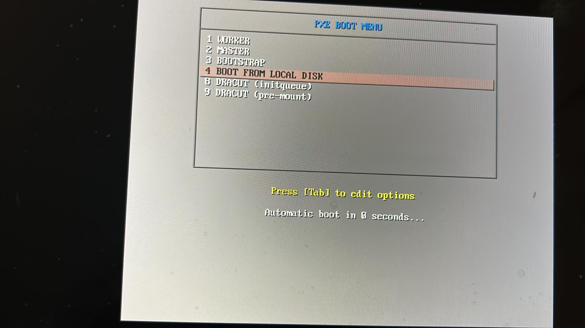

# RHCOP_JNPR_CN2_UPI

## Reference Documents
* [Redhat Guide](https://docs.openshift.com/container-platform/4.12/installing/installing_bare_metal/installing-restricted-networks-bare-metal.html)
## Get PullSecret
* Open the [URL](https://console.redhat.com/openshift/install/metal/user-provisioned) by logging in with your Redhat account.
* Only copy/ get "pull secret" as required images/ packages will be downloaded by a scripit download_ocp_images.sh in later step.
## Get this Git Repo
```
git clone https://github.com/kashif-nawaz/RHCOP_JNPR_CN2_UPI
```
## Jumphost Bringup
```

wget 'https://cloud.centos.org/centos/8/x86_64/images/CentOS-8-GenericCloud-8.4.2105-20210603.0.x86_64.qcow2'
sudo qemu-img create -b /var/lib/libvirt/images/CentOS-8-GenericCloud-8.4.2105-20210603.0.x86_64.qcow2  -f qcow2 -F qcow2 /var/lib/libvirt/images/bastion.qcow2 200G

sudo virt-customize  -a /var/lib/libvirt/images/bastion.qcow2   --run-command 'xfs_growfs /' --selinux-relabel

cloud-localds -v  bastion-cloud-init.img bastion-cloud-init.cfg


virt-install --name ocp-bastion \
  --virt-type kvm --memory 8192  --vcpus 8 \
  --boot hd,menu=on \
  --disk path=bastion-cloud-init.img,device=cdrom \
  --disk path=/var/lib/libvirt/images/bastion.qcow2,device=disk \
  --os-type=Linux \
  --os-variant=rhel8.0 \
  --network bridge:br-ctrplane \
  --network bridge:br-external \
  --graphics vnc,listen=0.0.0.0 --noautoconsole
  ```
  * Execute jmphost_setup.sh scripit to install required packages on Jumphost 

  ```
  cd ~/RHCOP_JNPR_CN2_UPI
  ./jmphost_setup.sh
  ```

  * Download OCP Packages/ images 

  ```
  cd ~/RHCOP_JNPR_CN2_UPI
  chmod +x download_ocp_images.sh
  ./download_ocp_images.sh
  ```
  * Prepare DHCP Server
  * Do changes in ~/RHCOP_JNPR_CN2_UPI/dhcpd.conf as per your setup

  ```
  sudo cp ~/RHCOP_JNPR_CN2_UPI/dhcpd.conf /etc/dhcp
  sudo systemctl enable dhcpd --now
  sudo systemctl status dhcpd
  ```

  ### Prepareing Name Server
  * Do changes in ~/RHCOP_JNPR_CN2_UPI/named.conf  ,  ~/RHCOP_JNPR_CN2_UPI/zone.db and  ~/RHCOP_JNPR_CN2_UPI/zonefile.db as per your setup

  ```
  sudo cp ~/RHCOP_JNPR_CN2_UPI/named.conf  /etc
  sud cp  ~/RHCOP_JNPR_CN2_UPI/zone.db /var/named/
  sudo ~/RHCOP_JNPR_CN2_UPI/zonefile.db /var/named/
  ```
  * Update DNS config on primary interface of Jumphost 
  ```
  sudo nmcli connection modify eth0 ipv4.dns 127.0.0.1
  sudo nmcli connection modify eth0 ipv4.dns-search ocp.pxe.com
  sudo nmcli connection modify eth0 ipv4.ignore-auto-dns yes
  sudo systemctl restart NetworkManager
  ```

  * Preparing Webserver 
  
  ```
  sudo mkdir -p /var/www/html/rhcos
  sudo mkdir -p /var/www/html/ignition
  sudo mv ~/rhcos-live-rootfs.x86_64.img /var/www/html/rhcos/rhcos-live-rootfs
  sudo restorecon -RFv /var/www/html/rhcos/
  sudo sed -i 's/Listen 80/Listen 0.0.0.0:8080/' /etc/httpd/conf/httpd.conf
  ```
  ### Prepare tftp Server
  * Move kernel and initrmfs images downloaded in one of above step to /var/lib/tftpboot/
  ```
  sudo mkdir -p /var/lib/tftpboot/rhcos
  sudo mv ~/rhcos-live-initramfs.x86_64.img /var/lib/tftpboot/rhcos/initramfs.img
  sudo mv ~/rhcos-live-kernel-x86_64 /var/lib/tftpboot/rhcos/kernel
  sudo restorecon -RFv  /var/lib/tftpboot/rhcos
  ```
  * Make changes in "default" file available with this repo as per your enviornment 
  ```
  vim ~/RHCOP_JNPR_CN2_UPI/default
  :wq 
  sudo mkdir -p /var/lib/tftpboot/pxelinux.cfg/
  sudo mv ~/RHCOP_JNPR_CN2_UPI/default /var/lib/tftpboot/pxelinux.cfg/
 
  ```
  ### Prepare haproxy Server
  * Change ~/RHCOP_JNPR_CN2_UPI/haproxy.cfg as per your enviornment 

  ```
  vim ~/RHCOP_JNPR_CN2_UPI/haproxy.cfg
  sudo cp ~/RHCOP_JNPR_CN2_UPI/haproxy.cfg /etc/haproxy/
  ```
  ### Preparing NFS Server 

  ```
  sudo mkdir -p /shares/registry
  sudo chown -R nobody:nobody /shares/registry
  sudo chmod -R 777 /shares/registry
  sudo echo "/shares/registry  192.168.24.0/24(rw,sync,root_squash,no_subtree_check,no_wdelay)" > /etc/exports
  sudo exportfs -rv
  ```
  ### Adding Firewall Rules and Setting SELinux premission

  ```
  sudo firewall-cmd --add-port=8080/tcp --permanent
  sudo firewall-cmd --add-port={6443,22623}/tcp --permanent
  sudo firewall-cmd --add-service={dhcp,tftp,http,https,dns,mountd,rpc-bind,nfs} --permanent
  sudo firewall-cmd --reload
  sudo semanage port  -a 6443 -t http_port_t -p tcp
  sudo semanage port  -a 22623 -t http_port_t -p tcp
  sudo semanage port -a 32700 -t http_port_t -p tcp
  sudo setsebool -P haproxy_connect_any 1
  ```
  ### Starting Required Services
  ```
  sudo systemctl enable httpd --now
  sudo systemctl enable  tftp.service --now
  sudo systemctl enable named --now 
  sudo systemctl enable  haproxy --now
  sudo systemctl enable nfs-server rpcbind 
  sudo systemctl start nfs-server rpcbind nfs-mountd
  ```
  ### Preparing Openshift Installation Files 
  * Make sure pull-secret file is copied in Jumphost ~/ directory
  ```
  sudo tar xvf openshift-install-linux.tar.gz
  sudo mv openshift-install /usr/local/bin
  sudo tar xvf openshift-client-linux.tar.gz
  sudo mv oc kubectl /usr/local/bin
  openshift-install version
  oc version
  kubectl version --client
  ssh-keygen 
  mkdir ~/ocp-install
  ```
  * Prep base install file , change IP settings if required (or leave it as it is)

```
cat <<EOF > ocp-install-base-config.yaml
apiVersion: v1
baseDomain: pxe.com
compute:
- hyperthreading: Enabled
  name: worker
  replicas: 0
controlPlane:
  hyperthreading: Enabled
  name: master
  replicas: 3
metadata:
  name: ocp
networking:
  clusterNetworks:
  - cidr: 10.10.0.0/16
    hostPrefix: 24
  networkType: OpenShiftSDN
  serviceNetwork:
  - 172.172.0.0/16
platform:
  none: {}
pullSecret: '$(< ~/pull-secret)'
sshKey: '$(< ~/.ssh/id_rsa.pub)'
EOF
```
  * Preparing OCP  manifests files 
  ```
  cp ~/ocp-install-base-config.yaml ~/ocp-install
  cd ocp-install/
  openshift-install create manifests
  INFO Consuming Install Config from target directory
  WARNING Making control-plane schedulable by setting MastersSchedulable to true for Scheduler cluster settings
  INFO Manifests created in: manifests and openshift
  [contrail@bastion ocp-install]$ ls
  manifests  openshift
  ```
  * Disable POD Sechduling on Master nodes
  ```
  sed -i 's/true/false/' manifests/cluster-scheduler-02-config.yml
  ```
  * Prepare ignition files 
  ```
  [contrail@bastion ocp-install]$ openshift-install create ignition-configs
  INFO Consuming Worker Machines from target directory
  INFO Consuming Openshift Manifests from target directory
  INFO Consuming Common Manifests from target directory
  INFO Consuming Master Machines from target directory
  INFO Consuming OpenShift Install (Manifests) from target directory
  INFO Ignition-Configs created in: . and auth
  [contrail@bastion ocp-install]$ ls
  auth  bootstrap.ign  master.ign  metadata.json  worker.ign
  ```
  * Move ignition files to webserver directory 
  ```
  sudo mkdir -p /var/www/html/ignition
  sudo cp -v *.ign /var/www/html/ignition
  'bootstrap.ign' -> '/var/www/html/ignition/bootstrap.ign'
  'master.ign' -> '/var/www/html/ignition/master.ign'
  'worker.ign' -> '/var/www/html/ignition/worker.ign'

  sudo chmod 644 /var/www/html/ignition/*.ign
  sudo restorecon -RFv /var/www/html/
    Relabeled /var/www/html/ignition from unconfined_u:object_r:httpd_sys_content_t:s0 to system_u:object_r:httpd_sys_content_t:s0
    Relabeled /var/www/html/ignition/bootstrap.ign from unconfined_u:object_r:httpd_sys_content_t:s0 to system_u:object_r:httpd_sys_content_t:s0
    Relabeled /var/www/html/ignition/master.ign from unconfined_u:object_r:httpd_sys_content_t:s0 to system_u:object_r:httpd_sys_content_t:s0
    Relabeled /var/www/html/ignition/worker.ign from unconfined_u:object_r:httpd_sys_content_t:s0 to system_u:object_r:httpd_sys_content_t:s0

  ls /var/www/html/ignition/
    bootstrap.ign  master.ign  worker.ign
  ```
  ### Services Verfication 
  * Verify Firewall Rules
  ```
  sudo firewall-cmd --list-all
  public (active)
  target: default
  icmp-block-inversion: no
  interfaces: eth0
  sources:
  services: cockpit dhcp dhcpv6-client dns http https mountd nfs rpc-bind ssh tftp
  ports: 8080/tcp 6443/tcp 22623/tcp
  protocols:
  forward: no
  masquerade: no
  forward-ports:
  source-ports:
  icmp-blocks:
  rich rules:
  ```

  * Verify Name Server 

  ```
  dig +noall +answer 192.168.24.13 api.ocp.pxe.com
  api.ocp.pxe.com.	604800	IN	A	192.168.24.13

  dig +noall +answer 192.168.24.13 api-int.ocp.pxe.com
  api-int.ocp.pxe.com.	604800	IN	A	192.168.24.13

  dig +noall +answer 192.168.24.13  random.apps.ocp.pxe.com
  random.apps.ocp.pxe.com. 604800	IN	A	192.168.24.13
  
  dig +noall +answer 192.168.24.13  console-openshift-console.apps.ocp.pxe.com
  console-openshift-console.apps.ocp.pxe.com. 604800 IN A	192.168.24.13 

  dig +noall +answer 192.168.24.13 bootstrap.ocp.pxe.com
  bootstrap.ocp.pxe.com.	604800	IN	A	192.168.24.200

  dig +noall +answer 192.168.24.13 -x 192.168.24.200
  200.24.168.192.in-addr.arpa. 604800 IN	PTR	bootstrap.ocp.pxe.com.
  ```
  * Verify web server 

  ```
  curl -I http://192.168.24.13:8080/ignition/bootstrap.ign
  HTTP/1.1 200 OK
  Date: Fri, 10 Feb 2023 06:54:32 GMT
  Server: Apache/2.4.37 (centos)
  Last-Modified: Thu, 09 Feb 2023 00:22:00 GMT
  ETag: "44b59-5f4395e939818"
  Accept-Ranges: bytes
  Content-Length: 281433
  Content-Type: application/vnd.coreos.ignition+json

  curl -I http://192.168.24.13:8080/ignition/master.ign
  HTTP/1.1 200 OK
  Date: Fri, 10 Feb 2023 06:55:38 GMT
  Server: Apache/2.4.37 (centos)
  Last-Modified: Thu, 09 Feb 2023 00:22:00 GMT
  ETag: "6b1-5f4395e939818"
  Accept-Ranges: bytes
  Content-Length: 1713
  Content-Type: application/vnd.coreos.ignition+json

  curl -I http://192.168.24.13:8080/ignition/worker.ign
  HTTP/1.1 200 OK
  Date: Fri, 10 Feb 2023 06:56:23 GMT
  Server: Apache/2.4.37 (centos)
  Last-Modified: Thu, 09 Feb 2023 00:22:00 GMT
  ETag: "6b1-5f4395e939c00"
  Accept-Ranges: bytes
  Content-Length: 1713
  Content-Type: application/vnd.coreos.ignition+json

  curl -I http://192.168.24.13:8080/rhcos/rhcos-live-rootfs
  HTTP/1.1 200 OK
  Date: Fri, 10 Feb 2023 06:57:58 GMT
  Server: Apache/2.4.37 (centos)
  Last-Modified: Thu, 09 Feb 2023 00:17:27 GMT
  ETag: "41c70c00-5f4394e4fca8a"
  Accept-Ranges: bytes
  Content-Length: 1103563776
  ```
  ### Create Bootstrap and Controller VMs
  * Bootstrap VM
  ```
  sudo virt-install -n bootstrap.ocp.pxe.com \
  --description "Bootstrap Machine for Openshift 4 Cluster" \
  --ram=16384 \
  --vcpus=8 \
  --os-type=Linux \
  --os-variant=rhel8.0 \
   --noreboot \
  --disk pool=images,bus=virtio,size=100 \
  --graphics vnc,listen=0.0.0.0 --noautoconsole \
  --boot network,hd,menu=on \
  --network bridge=br-ctrplane,mac=52:54:00:a4:db:5f
  
  sudo virsh --connect qemu:///system start bootstrap.ocp.pxe.com
  Domain 'bootstrap.ocp.pxe.com' started
  ```
  * Connect to bootstrap VM via console (VNC Viewer in my case )
  ```
  virsh vncdisplay bootstrap.ocp.pxe.com
  :1 
  ```
  * PXE boot and Select "Bootstrap" from the PXE Boot Menue 
  
  * Once kernel and initramfs images are downloaded from tftp server , boot server will reboot.
  * During reboot , from PXE boot menu select "Local Boot"

  * Repeat same steps for Master1..3 VMs

  ```
  sudo virt-install -n master01.ocp4.example.com \
   --description "master01 Machine for Openshift 4 Cluster" \
   --ram=16384 \
   --vcpus=8 \
   --os-type=Linux \
   --os-variant=rhel8.0 \
   --noreboot \
   --disk pool=images,bus=virtio,size=100 \
   --graphics vnc,listen=0.0.0.0 --noautoconsole \
   --boot network,hd,menu=on \
   --network bridge=br-ctrplane,mac=52:54:00:8b:a1:17

  sudo virt-install -n master02.ocp4.example.com  \
   --description "Master02 Machine for Openshift 4 Cluster" \
   --ram=16384 \
   --vcpus=8 \
   --os-type=Linux \
   --os-variant=rhel8.0 \
   --noreboot \
   --disk pool=images,bus=virtio,size=100 \
   --graphics vnc,listen=0.0.0.0 --noautoconsole \
   --boot network,hd,menu=on \
   --network bridge=br-ctrplane,mac=52:54:00:ea:8b:9d
  ```
  * Monitoring Bootstraping process from Jumphost 

  ```
  openshift-install --dir ~/ocp-install wait-for bootstrap-complete --log-level=debug
  time="2023-02-09T02:30:56Z" level=info msg="Waiting up to 20m0s (until 2:50AM) for the Kubernetes API at https://api.ocp.pxe.com:6443..."
  time="2023-02-09T02:30:57Z" level=info msg="API v1.25.4+77bec7a up"
  time="2023-02-09T02:30:57Z" level=debug msg="Loading Install Config..."
  time="2023-02-09T02:30:57Z" level=debug msg="  Loading SSH Key..."
  time="2023-02-09T02:30:57Z" level=debug msg="  Loading Base Domain..."
  time="2023-02-09T02:30:57Z" level=debug msg="    Loading Platform..."
  time="2023-02-09T02:30:57Z" level=debug msg="  Loading Cluster Name..."
  time="2023-02-09T02:30:57Z" level=debug msg="    Loading Base Domain..."
  time="2023-02-09T02:30:57Z" level=debug msg="    Loading Platform..."
  time="2023-02-09T02:30:57Z" level=debug msg="  Loading Networking..."
  time="2023-02-09T02:30:57Z" level=debug msg="    Loading Platform..."
  time="2023-02-09T02:30:57Z" level=debug msg="  Loading Pull Secret..."
  time="2023-02-09T02:30:57Z" level=debug msg="  Loading Platform..."
  time="2023-02-09T02:30:57Z" level=debug msg="Using Install Config loaded from state file"
  time="2023-02-09T02:30:57Z" level=info msg="Waiting up to 30m0s (until 3:00AM) for bootstrapping to complete..."
  time="2023-02-09T02:45:04Z" level=debug msg="Bootstrap status: complete"
  time="2023-02-09T02:45:04Z" level=info msg="It is now safe to remove the bootstrap resources"
  time="2023-02-09T02:45:04Z" level=debug msg="Time elapsed per stage:"
  time="2023-02-09T02:45:04Z" level=debug msg="Bootstrap Complete: 14m7s"
  time="2023-02-09T02:45:04Z" level=info msg="Time elapsed: 14m7s"
  ``` 
  * Monitoring Bootstraping process from Bootstrap node

  ```
  ssh core@192.168.24.200 'journalctl -b -f -u release-image.service -u bootkube.service'
  Mon 06 00:01:56 bootstrap.ocp.lab.com bootkube.sh[12661]: bootkube.service complete
  Mon 06 00:01:56 bootstrap.ocp.lab.com systemd[1]: bootkube.service: Succeeded.
  ```
  * Remove Bootstrap from haproxy config

  ```
  sudo cat  /etc/haproxy/haproxy.cfg | grep boot
  server bootstrap 192.168.24.200:6443 check
  server bootstrap 192.168.24.200:22623 check
  sudo sed -i -e 's/server bootstrap 192.168.24.200:6443 check//' /etc/haproxy/haproxy.cfg
  sudo sed -i -e 's/server bootstrap 192.168.24.200:22623 check//' /etc/haproxy/haproxy.cfg
  sudo cat /etc/haproxy/haproxy.cfg | grep boot
  sudo systemctl restart  haproxy
  ```


