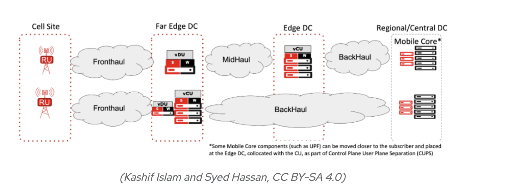
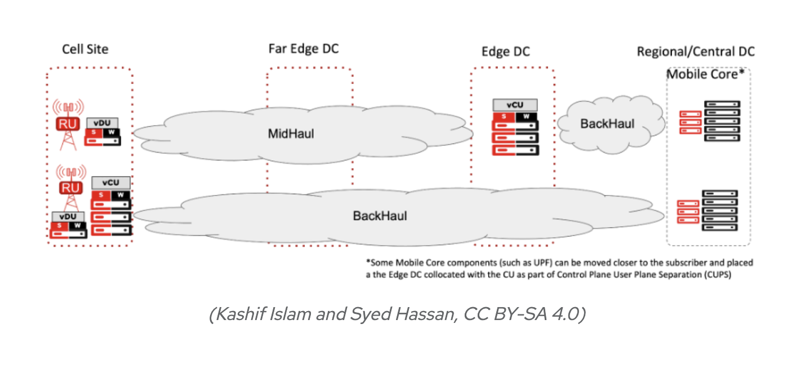
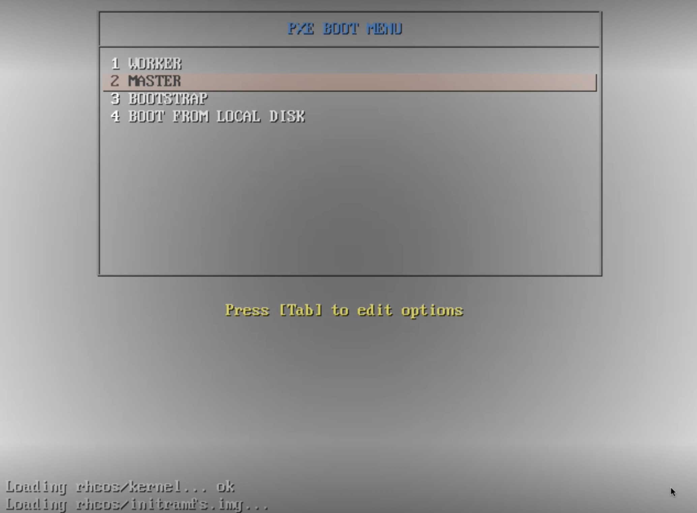

# Redhat Openshift_Juniper_CN2 Installation over User Provisioned Infrastructure
## Problem Statement 
* Redhat Openshift is getting lots of attractions in 5G RAN market due to its feature richness.
* 5G RAN VDU (virtual distribution unit,  Far Edge) and VCU (virtual control unit, Edge DC) are the target places where Openshift is getting deployed besides region data center where 5G core components are placed.
* Courtesy to [Redat](https://www.redhat.com/architect/ran-radio-access-network-definitions) for these design diagrams.
* 
*  
* So for the Juniper Contrail Classic is only deployed in regional data centers alogwith Openstack to provide overlay networking for 5G core, IMS or other virtual functions limited to regional data centers.
* As Cloud Native 5G RAN is getting a lot of attraction for Openshift so it has opened new marketplace for Juniper Networks cloud native products (JCNR  or CN2).
* So far, installation method for CN2 covers Assited Installer where target machines have to be booted manually using Red Hat CoreOS ISO image. 
* The Openshift assisted installer is also hosted on Redhat Cloud so it means internet connectivity is required for the target nodes.
* In real life deployment scenarios internet access is limited or restricted in edge / telco cloud site due to security reasons.  
* This document  focuses on User Provisined Infrastrure deployment for Red Hat Open Shift where target  machines will get a menu from tftp  server via pxe boot and from that menu we can install desired role in the machine.
* Local registry to host Red Hat Open Shift Container images and CN2 Contrainer images will also be built in the next phase to make it truly 'disconnected installation'.

## Reference Documents
* [Redhat Guide](https://docs.openshift.com/container-platform/4.12/installing/installing_bare_metal/installing-restricted-networks-bare-metal.html)
* [Git Repo](https://github.com/openshift/installer)
## Lab Topology
* 
* Bastion VM will host (dhcp, named, tftp ,http, haproxy) services. 
## Get PullSecret
* Open the [URL](https://console.redhat.com/openshift/install/metal/user-provisioned) by logging in with your Redhat account.
* Only copy/ get "pull secret" as required images/ packages will be in a later step.
## Jumphost Bringup
```
wget 'https://cloud.centos.org/centos/8/x86_64/images/CentOS-8-GenericCloud-8.4.2105-20210603.0.x86_64.qcow2'
sudo qemu-img create -b /var/lib/libvirt/images/CentOS-8-GenericCloud-8.4.2105-20210603.0.x86_64.qcow2  -f qcow2 -F qcow2 /var/lib/libvirt/images/ocp_pxe_jumphost.qcow2 200G

sudo virt-customize  -a /var/lib/libvirt/images/ocp_pxe_jumphost.qcow2   --run-command 'xfs_growfs /' --selinux-relabel

  cat > ocp_pxe_jumphost_cloud_init.cfg <<END_OF_SCRIPT
#cloud-config
hostname: bastion
fqdn: bastion.ocp.pxe.com
manage_etc_hosts: false
users:
  - name: lab
    groups: wheel
    lock_passwd: false
    shell: /bin/bash
    home: /home/lab
    ssh_pwauth: true
    ssh-authorized-keys:
      - 'ssh-key'
    sudo: ['ALL=(ALL) NOPASSWD:ALL']
chpasswd:
  list: |
     lab:contrail123
  expire: False
write_files:
  - path:  /etc/sudoers.d/lab
    permissions: '0440'
    content: |
         lab ALL=(root) NOPASSWD:ALL
  - path:  /etc/sysconfig/network-scripts/ifcfg-eth0
    permissions: '0644'
    content: |
         TYPE=Ethernet
         PROXY_METHOD=none
         BROWSER_ONLY=no
         BOOTPROTO=none
         IPV4_FAILURE_FATAL=no
         NAME=eth0
         DEVICE=eth0
         ONBOOT=yes
         IPADDR=192.168.24.13
         NETMASK=255.255.255.0
         GATEWAY=192.168.24.1
         DNS1=1.1.1.1
         PEERDNS=yes
runcmd:
 - [sudo, ifup, eth0]
 - [sudo, sed ,-i, 's/PasswordAuthentication no/PasswordAuthentication yes/g', /etc/ssh/sshd_config]
 - [sudo, systemctl, restart, sshd]
END_OF_SCRIPT

cloud-localds -v  ocp_pxe_jumphost_cloud_init.img ocp_pxe_jumphost_cloud_init.cfg


virt-install --name ocp_pxe_jumphost \
  --virt-type kvm --memory 16384  --vcpus 8 \
  --boot hd,menu=on \
  --disk path=ocp_pxe_jumphost_cloud_init.img,device=cdrom \
  --disk path=/var/lib/libvirt/images/ocp_pxe_jumphost.qcow2,device=disk \
  --os-type=Linux \
  --os-variant=rhel8.0 \
  --network bridge:br-ctrplane \
  --graphics vnc,listen=0.0.0.0 --noautoconsole

  ```
  * Execute jmphost_setup.sh script to install required packages on Jumphost.

  ```
  cat <<EOF> jmphost_setup.sh
  sudo dnf --disablerepo '*' --enablerepo=extras swap centos-linux-repos centos-stream-repos -y
  sudo dnf distro-sync -y
  sudo dnf -y install epel-release
  sudo dnf -y install ipmitool git dhcp-server tftp-server syslinux  httpd haproxy  bind bind-utils  vim wget curl bash-completion  nfs-utils  tree tar libselinux-python3 firewalld
  sudo reboot
  EOF
  chmod +x jmphost_setup.sh
  ./jmphost_setup.sh
  ```

  ### Download Openshift Images 
  * Download following images from the [ULR](https://mirror.openshift.com/pub/openshift-v4/dependencies/rhcos/) as per required version. 
  * kernel: rhcos-<version>-live-kernel-<architecture>
  * initramfs: rhcos-<version>-live-initramfs.<architecture>.img
  * rootfs: rhcos-<version>-live-rootfs.<architecture>.img
  * coreos: rhcos-<version>-x86_64-metal.x86_64.raw.gz
  ```
  cat <<EOF> download_ocp_images.sh
  curl https://mirror.openshift.com/pub/openshift-v4/dependencies/rhcos/latest/rhcos-live-rootfs.x86_64.img --output rhcos-live-rootfs.x86_64.img
  curl https://mirror.openshift.com/pub/openshift-v4/dependencies/rhcos/latest/rhcos-installer-kernel-x86_64 --output rhcos-installer-kernel-x86_64
  curl https://mirror.openshift.com/pub/openshift-v4/dependencies/rhcos/latest/rhcos-installer-initramfs.x86_64.img --output rhcos-installer-initramfs.x86_64.img
  curl https://mirror.openshift.com/pub/openshift-v4/dependencies/rhcos/latest/rhcos-4.12.2-x86_64-metal.x86_64.raw.gz --output rhcos-4.12.2-x86_64-metal.x86_64.raw.gz
  EOF
  ``` 
  ### Download Installer and CLI Packages
  * Download openshift-installer and openhift-client (CLI) packages from the [URL](https://mirror.openshift.com/pub/openshift-v4/x86_64/clients/ocp/) as per required version. 

  ```
  curl https://mirror.openshift.com/pub/openshift-v4/clients/ocp/stable/openshift-install-linux.tar.gz --output openshift-install-linux.tar.gz
  curl https://mirror.openshift.com/pub/openshift-v4/clients/ocp/latest/openshift-client-linux.tar.gz --output openshift-client-linux.tar.gz
  ```
  * Get this Git Repo
  ```
   git clone https://github.com/kashif-nawaz/RHCOP_JNPR_CN2_UPI
  ```
  * Prepare DHCP Server
  * Do changes in ~/RHCOP_JNPR_CN2_UPI/dhcpd.conf as per your setup

  ```
  sudo cp ~/RHCOP_JNPR_CN2_UPI/dhcpd.conf /etc/dhcp
  sudo systemctl enable dhcpd --now
  sudo systemctl status dhcpd
  ```

  ### Prepareing Name Server
  * Do changes in ~/RHCOP_JNPR_CN2_UPI/named.conf  ,  ~/RHCOP_JNPR_CN2_UPI/zone.db and  ~/RHCOP_JNPR_CN2_UPI/zonefile.db as per your setup

  ```
  sudo cp ~/RHCOP_JNPR_CN2_UPI/named.conf  /etc
  sud cp  ~/RHCOP_JNPR_CN2_UPI/reverse.db /var/named/
  sudo ~/RHCOP_JNPR_CN2_UPI/zonefile.db /var/named/
  ```
  * Update DNS config on primary interface of Jumphost 
  ```
  sudo nmcli connection modify eth0 ipv4.dns 127.0.0.1
  sudo nmcli connection modify eth0 ipv4.dns-search ocp.pxe.com
  sudo nmcli connection modify eth0 ipv4.ignore-auto-dns yes
  sudo systemctl restart NetworkManager
  ```

  ### Preparing Web Server 
  ```
  sudo mkdir -p /var/www/html/rhcos
  sudo mkdir -p /var/www/html/ignition
  sudo mv ~/rhcos-live-rootfs.x86_64.img /var/www/html/rhcos/rhcos-live-rootfs
  sudo mv ~/rhcos-4.12.2-x86_64-metal.x86_64.raw.gz /var/www/html/rhcos/rhcos-4.12.2-x86_64-metal.x86_64.raw.gz
  sudo restorecon -RFv /var/www/html/rhcos/
  sudo sed -i 's/Listen 80/Listen 0.0.0.0:8080/' /etc/httpd/conf/httpd.conf
  ```
  ### Prepare TFTP Server
  * Move kernel and initrmfs images, downloaded in one of above step to /var/lib/tftpboot/
  ```
  sudo mkdir -p /var/lib/tftpboot/rhcos
  sudo mv ~/rhcos-installer-initramfs.x86_64.img /var/lib/tftpboot/rhcos/initramfs.img
  sudo mv ~/rhcos-installer-kernel-x86_64 /var/lib/tftpboot/rhcos/kernel
  sudo restorecon -RFv  /var/lib/tftpboot/rhcos
  ```
  * Make changes in "default" file available with this repo as per your environment. 
  ```

  vim ~/RHCOP_JNPR_CN2_UPI/default
  :wq 
  sudo mkdir -p /var/lib/tftpboot/pxelinux.cfg/
  sudo mv ~/RHCOP_JNPR_CN2_UPI/default /var/lib/tftpboot/pxelinux.cfg/
  sudo cp -rvf /usr/share/syslinux/* /var/lib/tftpboot
 
  ```
  ### Prepare haproxy Server
  * Change ~/RHCOP_JNPR_CN2_UPI/haproxy.cfg as per your enviornment 
  ```
  vim ~/RHCOP_JNPR_CN2_UPI/haproxy.cfg
  sudo cp ~/RHCOP_JNPR_CN2_UPI/haproxy.cfg /etc/haproxy/
  ```
  ### Adding Firewall Rules and Setting SELinux Permissions
  ```
  sudo firewall-cmd --add-port=8080/tcp --permanent
  sudo firewall-cmd --add-port={6443,22623}/tcp --permanent
  sudo firewall-cmd --add-service={dhcp,tftp,http,https,dns,mountd,rpc-bind,nfs} --permanent
  sudo firewall-cmd --reload
  sudo semanage port  -a 6443 -t http_port_t -p tcp
  sudo semanage port  -a 22623 -t http_port_t -p tcp
  sudo semanage port -a 32700 -t http_port_t -p tcp
  sudo setsebool -P haproxy_connect_any 1
  ```
  ### Starting Required Services
  ```
  sudo systemctl enable httpd --now
  sudo systemctl enable  tftp.service --now
  sudo systemctl enable named --now 
  sudo systemctl enable  haproxy --now
  ```
  ## Preparing  Installation Files 
  * Make sure pull-secret file is copied in Jumphost ~/ directory
  ```
  sudo tar xvf openshift-install-linux.tar.gz
  sudo mv openshift-install /usr/local/bin
  sudo tar xvf openshift-client-linux.tar.gz
  sudo mv oc kubectl /usr/local/bin
  openshift-install version
  oc version
  kubectl version --client
  ssh-keygen 
  ```
  ### Preparing Openshift install-config.yaml
  * Change IP settings if required (or leave it as it is)

```
cat <<EOF > install-config.yaml
apiVersion: v1
baseDomain: pxe.com
compute:
- hyperthreading: Enabled
  name: worker
  replicas: 0
controlPlane:
  hyperthreading: Enabled
  name: master
  replicas: 3
metadata:
  name: ocp
networking:
  clusterNetworks:
  - cidr: 10.10.0.0/16
    hostPrefix: 24
  networkType: Contrail
  serviceNetwork:
  - 172.172.0.0/16
platform:
  none: {}
pullSecret: '$(< ~/pull-secret)'
sshKey: '$(< ~/.ssh/id_rsa.pub)'
EOF
```
  ### Preparing Login Credentials to access  CN2 Container Images Registry
  * Get login credentials for enterprise-hub.juniper.net [Reference](https://www.juniper.net/documentation/us/en/software/cn-cloud-native22/cn-cloud-native-k8s-install-and-lcm/topics/task/cn-cloud-native-k8s-configure-secrets.html)
  ```
  sudo yum install -y yum-utils
  sudo yum-config-manager     --add-repo     https://download.docker.com/linux/centos/docker-ce.repo
  sudo yum install docker-ce docker-ce-cli containerd.io docker-buildx-plugin docker-compose-plugin -y
  docker login enterprise-hub.juniper.net
  Username: username 
  Password: token to access enterprise-hub.juniper.net
  WARNING! Your password will be stored unencrypted in /home/contrail/.docker/config.json.
  Configure a credential helper to remove this warning. See
  https://docs.docker.com/engine/reference/commandline/login/#credentials-store
  Login Succeeded

  cat ~/.docker/config.json
  ENCODED_CREDS=$(base64 -w 0 ~/.docker/config.json)
  cd cn2_22_4/contrail-manifests-openshift/manifests/
  echo $ENCODED_CREDS
  cat ~/.docker/config.json
  ENCODED_CREDS=$(base64 -w 0 ~/.docker/config.json)
  echo $ENCODED_CREDS
  ```
  ### Prepare CN2 Manifests files
  * Download CN2 manifests from Juniper Support portal [Reference](https://support.juniper.net/support/downloads)
  * Reference link to prepare [CN2 manifests](https://www.juniper.net/documentation/us/en/software/cn-cloud-native22/cn-cloud-native-ocp-install-and-lcm/topics/topic-map/cn-cloud-native-ocp-manifests-and-tools.html)
  ```
  mkdir ~/cn2_22_4
  mv ~/contrail-manifests-openshift-22.4.0.284.tgz ~/cn2_22_4
  cd ~/cn2_22_4
  tar xvf contrail-manifests-openshift-22.4.0.284.tgz
  cd contrail-manifests-openshift/
  mkdir manifests
  cp *yaml manifests
  cp cert-manager-1.8/*.yaml manifests/
  sed -i s/'<base64-encoded-credential>'/$ENCODED_CREDS/ auth-registry/*.yaml
  In 99-disable-offload-worker.yaml change interface name as per your setup 
  ```
  * Removing DPDK manifests files if DPDK vROuter is not required 
  ```
  rm manifests/050-dpdk-machineconfigpool.yaml manifests/112-vrouter-dpdk-nodes-cr.yaml
  rm manifests/051-worker-vfio-pci.yaml manifests/052-kargs-1g-hugepages.yaml
  In 99-disable-offload-worker.yaml change interface name as per your setup 
  ```
  ### Preparing OCP  manifests files 
  * File name in installation directory must be [install-config.yaml](https://access.redhat.com/solutions/4514661)
  ```
  mkdir ~/ocp-install
  cp ~/install-config.yaml ~/ocp-install/install-config.yaml
  cd ocp-install/
  openshift-install create manifests --log-level=debug
  INFO Manifests created in: manifests and openshift
  [contrail@bastion ocp-install]$ ls
  manifests  openshift
  ```
  * Copy CN2 manifests prepared in above step into ~/ocp-install/manifests
  ```
   cp ~/cn2_22_4/contrail-manifests-openshift/manifests/*yaml ~/ocp-install/manifests
  ```
  * Disable POD Sechduling on Master nodes
  ```
  cd ~/ocp-install
  sed -i 's/true/false/' manifests/cluster-scheduler-02-config.yml
  ```
  * Prepare ignition files 
  ```
  [contrail@bastion ocp-install]$ openshift-install create ignition-configs --log-level=debug 
  INFO Consuming Worker Machines from target directory
  INFO Consuming Openshift Manifests from target directory
  INFO Consuming Common Manifests from target directory
  INFO Consuming Master Machines from target directory
  INFO Consuming OpenShift Install (Manifests) from target directory
  INFO Ignition-Configs created in: . and auth
  [contrail@bastion ocp-install]$ ls
  auth  bootstrap.ign  master.ign  metadata.json  worker.ign
  ```
  * Move ignition files to webserver directory 
  ```
  sudo mkdir -p /var/www/html/ignition
  sudo mv -v *.ign /var/www/html/ignition
  'bootstrap.ign' -> '/var/www/html/ignition/bootstrap.ign'
  'master.ign' -> '/var/www/html/ignition/master.ign'
  'worker.ign' -> '/var/www/html/ignition/worker.ign'

  sudo chmod 644 /var/www/html/ignition/*.ign
  sudo restorecon -RFv /var/www/html/
    Relabeled /var/www/html/ignition from unconfined_u:object_r:httpd_sys_content_t:s0 to system_u:object_r:httpd_sys_content_t:s0
    Relabeled /var/www/html/ignition/bootstrap.ign from unconfined_u:object_r:httpd_sys_content_t:s0 to system_u:object_r:httpd_sys_content_t:s0
    Relabeled /var/www/html/ignition/master.ign from unconfined_u:object_r:httpd_sys_content_t:s0 to system_u:object_r:httpd_sys_content_t:s0
    Relabeled /var/www/html/ignition/worker.ign from unconfined_u:object_r:httpd_sys_content_t:s0 to system_u:object_r:httpd_sys_content_t:s0

  ls /var/www/html/ignition/
    bootstrap.ign  master.ign  worker.ign
  ```
  ### Services Verfication 
  * Verify Firewall Rules
  ```
  sudo firewall-cmd --list-all
  public (active)
  target: default
  icmp-block-inversion: no
  interfaces: eth0
  sources:
  services: cockpit dhcp dhcpv6-client dns http https mountd nfs rpc-bind ssh tftp
  ports: 8080/tcp 6443/tcp 22623/tcp
  protocols:
  forward: no
  masquerade: no
  forward-ports:
  source-ports:
  icmp-blocks:
  rich rules:
  ```

  * Verify Name Server 

  ```
  dig +noall +answer @127.0.0.1 api.ocp.pxe.com
  api.ocp.pxe.com.	604800	IN	A	192.168.24.13

  dig +noall +answer @127.0.0.1 api-int.ocp.pxe.com
  api-int.ocp.pxe.com.	604800	IN	A	192.168.24.13

  dig +noall +answer @127.0.0.1  random.apps.ocp.pxe.com
  random.apps.ocp.pxe.com. 604800	IN	A	192.168.24.13
  
  dig +noall +answer @127.0.0.1  console-openshift-console.apps.ocp.pxe.com
  console-openshift-console.apps.ocp.pxe.com. 604800 IN A	192.168.24.13 

  dig +noall +answer @127.0.0.1 bootstrap.ocp.pxe.com
  bootstrap.ocp.pxe.com.	604800	IN	A	192.168.24.200

  dig +noall +answer @127.0.0.1 -x 192.168.24.200
  200.24.168.192.in-addr.arpa. 604800 IN	PTR	bootstrap.ocp.pxe.com.

  dig +noall +answer @127.0.0.1 -x 192.168.24.13
  13.24.168.192.in-addr.arpa. 604800 IN	PTR	api.ocp.pxe.com.
  13.24.168.192.in-addr.arpa. 604800 IN	PTR	api-int.ocp.pxe.com.
  ```
  * Verify web server 

  ```
  curl -I http://192.168.24.13:8080/ignition/bootstrap.ign
  HTTP/1.1 200 OK
  Date: Fri, 10 Feb 2023 06:54:32 GMT
  Server: Apache/2.4.37 (centos)
  Last-Modified: Thu, 09 Feb 2023 00:22:00 GMT
  ETag: "44b59-5f4395e939818"
  Accept-Ranges: bytes
  Content-Length: 281433
  Content-Type: application/vnd.coreos.ignition+json

  curl -I http://192.168.24.13:8080/ignition/master.ign
  HTTP/1.1 200 OK
  Date: Fri, 10 Feb 2023 06:55:38 GMT
  Server: Apache/2.4.37 (centos)
  Last-Modified: Thu, 09 Feb 2023 00:22:00 GMT
  ETag: "6b1-5f4395e939818"
  Accept-Ranges: bytes
  Content-Length: 1713
  Content-Type: application/vnd.coreos.ignition+json

  curl -I http://192.168.24.13:8080/ignition/worker.ign
  HTTP/1.1 200 OK
  Date: Fri, 10 Feb 2023 06:56:23 GMT
  Server: Apache/2.4.37 (centos)
  Last-Modified: Thu, 09 Feb 2023 00:22:00 GMT
  ETag: "6b1-5f4395e939c00"
  Accept-Ranges: bytes
  Content-Length: 1713
  Content-Type: application/vnd.coreos.ignition+json

  curl -I http://192.168.24.13:8080/rhcos/rhcos-live-rootfs
  HTTP/1.1 200 OK
  Date: Fri, 10 Feb 2023 06:57:58 GMT
  Server: Apache/2.4.37 (centos)
  Last-Modified: Thu, 09 Feb 2023 00:17:27 GMT
  ETag: "41c70c00-5f4394e4fca8a"
  Accept-Ranges: bytes
  Content-Length: 1103563776

  curl -I http://192.168.24.13:8080/rhcos/rhcos-4.12.2-x86_64-metal.x86_64.raw.gz
  HTTP/1.1 200 OK
  Date: Sat, 11 Feb 2023 19:14:39 GMT
  Server: Apache/2.4.37 (centos)
  Last-Modified: Sat, 11 Feb 2023 16:58:49 GMT
  ETag: "48400000-5f46f8724b249"
  Accept-Ranges: bytes
  Content-Length: 1212153856
  ```
  ### Kick Off Openshift Installation 
  * Bootstrap VM
  ```
  sudo virt-install -n bootstrap.ocp.pxe.com \
  --description "Bootstrap Machine for Openshift 4 Cluster" \
  --ram=16384 \
  --vcpus=8 \
  --os-type=Linux \
  --os-variant=rhel8.0 \
   --noreboot \
  --disk pool=images,bus=virtio,size=100 \
  --graphics vnc,listen=0.0.0.0 --noautoconsole \
  --boot network,hd,menu=on \
  --network bridge=br-ctrplane,mac=52:54:00:a4:db:5f
  
  
  sudo virsh --connect qemu:///system start bootstrap.ocp.pxe.com
  Domain 'bootstrap.ocp.pxe.com' started
  ```
  * Connect to bootstrap VM via console (VNC Viewer in my case )
  ```
  virsh vncdisplay bootstrap.ocp.pxe.com
  :1 
  ```
  * PXE boot and Select "Bootstrap" from the PXE Boot Menue 
  
  * Once kernel and initramfs images are downloaded from tftp server , boot server will reboot.
  * During reboot , from PXE boot menu select "Local Boot"

  * Repeat same steps for Master1..3 VMs

  ```
  sudo virt-install -n master01.ocp.example.com \
   --description "master01 Machine for Openshift 4 Cluster" \
   --ram=16384 \
   --vcpus=8 \
   --os-type=Linux \
   --os-variant=rhel8.0 \
   --noreboot \
   --disk pool=images,bus=virtio,size=100 \
   --graphics vnc,listen=0.0.0.0 --noautoconsole \
   --boot network,hd,menu=on \
   --network bridge=br-ctrplane,mac=52:54:00:8b:a1:17

  sudo virt-install -n master02.ocp.example.com  \
   --description "Master02 Machine for Openshift 4 Cluster" \
   --ram=16384 \
   --vcpus=8 \
   --os-type=Linux \
   --os-variant=rhel8.0 \
   --noreboot \
   --disk pool=images,bus=virtio,size=100 \
   --graphics vnc,listen=0.0.0.0 --noautoconsole \
   --boot network,hd,menu=on \
   --network bridge=br-ctrplane,mac=52:54:00:ea:8b:9d

  sudo virt-install -n master03.ocp.example.com  \
  --description "Master03 Machine for Openshift 4 Cluster" \
  --ram=16384 \
  --vcpus=8 \
  --os-type=Linux \
  --os-variant=rhel8.0 \
   --noreboot \
  --disk pool=images,bus=virtio,size=100 \
  --graphics vnc,listen=0.0.0.0 --noautoconsole \
  --boot network,hd,menu=on \
  --network bridge=br-ctrplane,mac=52:54:00:f8:87:c7
  ```
  * My worker nodes are physical servers (Dell R720).
  * PXE boot is already enabled on Control Plane NIC and underlay network ports are  configured in access mode.
  * I am using VNC Viewer to Access Dell IDRAC Console for worker nodes [Reference](https://dl.dell.com/manuals/all-products/esuprt_software_int/esuprt_software_ent_systems_mgmt/openmanage-mobile-v33_White-Papers1_en-us.pdf)
  * ipmitool can be to used to turn on/ off the chassis 
  ```
  ipmitool -I lanplus -H $ipmi-ip -U $ipmi-user -P $ipmi-password  chassis power off
  ```
  * Monitoring Bootstraping process from Jumphost.

  ```
  openshift-install --dir ~/ocp-install wait-for bootstrap-complete --log-level=debug
  time="2023-02-09T02:30:56Z" level=info msg="Waiting up to 20m0s (until 2:50AM) for the Kubernetes API at https://api.ocp.pxe.com:6443..."
  time="2023-02-09T02:30:57Z" level=info msg="API v1.25.4+77bec7a up"
  time="2023-02-09T02:30:57Z" level=debug msg="Loading Install Config..."
  time="2023-02-09T02:30:57Z" level=debug msg="  Loading SSH Key..."
  time="2023-02-09T02:30:57Z" level=debug msg="  Loading Base Domain..."
  time="2023-02-09T02:30:57Z" level=debug msg="    Loading Platform..."
  time="2023-02-09T02:30:57Z" level=debug msg="  Loading Cluster Name..."
  time="2023-02-09T02:30:57Z" level=debug msg="    Loading Base Domain..."
  time="2023-02-09T02:30:57Z" level=debug msg="    Loading Platform..."
  time="2023-02-09T02:30:57Z" level=debug msg="  Loading Networking..."
  time="2023-02-09T02:30:57Z" level=debug msg="    Loading Platform..."
  time="2023-02-09T02:30:57Z" level=debug msg="  Loading Pull Secret..."
  time="2023-02-09T02:30:57Z" level=debug msg="  Loading Platform..."
  time="2023-02-09T02:30:57Z" level=debug msg="Using Install Config loaded from state file"
  time="2023-02-09T02:30:57Z" level=info msg="Waiting up to 30m0s (until 3:00AM) for bootstrapping to complete..."
  time="2023-02-09T02:45:04Z" level=debug msg="Bootstrap status: complete"
  time="2023-02-09T02:45:04Z" level=info msg="It is now safe to remove the bootstrap resources"
  time="2023-02-09T02:45:04Z" level=debug msg="Time elapsed per stage:"
  time="2023-02-09T02:45:04Z" level=debug msg="Bootstrap Complete: 14m7s"
  time="2023-02-09T02:45:04Z" level=info msg="Time elapsed: 14m7s"
  ``` 
  * Monitoring podman logs on Bootstrap node
  ```
  for pod in $(sudo podman ps -a -q); do sudo podman logs $pod; done
  ```
  * Monitoring Bootstraping process from Bootstrap node

  ```
  ssh core@192.168.24.200 'journalctl -b -f -u release-image.service -u bootkube.service'
  Mon 06 00:01:56 bootstrap.ocp.lab.com bootkube.sh[12661]: bootkube.service complete
  Mon 06 00:01:56 bootstrap.ocp.lab.com systemd[1]: bootkube.service: Succeeded.
  ```
  
  ### Post Deployment Operations 
  
  * Setup oc and kubectl clients

  ```
  export KUBECONFIG=~/ocp-install/auth/kubeconfig
  mkdir ~/.kube
  cp ~/ocp-install/auth/kubeconfig  ~/.kube/config
  oc get nodes 
  ```
  * oc get nodes might not show you all the master and worker nodes. 
  * Get Certificate Signing Requests and Approve it
  ```
  oc get csr
  oc get csr -o go-template='{{range .items}}{{if not .status}}{{.metadata.name}}{{"\n"}}{{end}}{{end}}' | xargs oc adm certificate approve
  ```
  * Wait for Certificate siging requests to be approved. 
  * Now oc get nodes should return all the nodes and if some node is "Notready" state then give it sometime. 

  * Remove Bootstrap from haproxy config
  ```
  sudo cat  /etc/haproxy/haproxy.cfg | grep boot
  server bootstrap 192.168.24.200:6443 check
  server bootstrap 192.168.24.200:22623 check
  sudo sed -i -e 's/server bootstrap 192.168.24.200:6443 check//' /etc/haproxy/haproxy.cfg
  sudo sed -i -e 's/server bootstrap 192.168.24.200:22623 check//' /etc/haproxy/haproxy.cfg
  sudo cat /etc/haproxy/haproxy.cfg | grep boot
  sudo systemctl restart  haproxy
  ```
  ### Configuring NFS Server to Host Openshift Image registry
  * By default Openshift installation removes Image Registry operators in User Provisioned Infrastructre deployment because no stroage pool is available and deployment would be stopped if Image Registry operators is not removed
  *  Preparing NFS Server 
  ```
  sudo systemctl enable nfs-server rpcbind 
  sudo systemctl start nfs-server rpcbind nfs-mountd
  sudo mkdir -p /shares/registry
  sudo chown -R nobody:nobody /shares/registry
  sudo chmod -R 777 /shares/registry
  sudo echo "/shares/registry  192.168.24.0/24(rw,sync,root_squash,no_subtree_check,no_wdelay)" > /etc/exports
  sudo exportfs -rv
  sudo firewall-cmd --add-service={mountd,rpc-bind,nfs} --permanent
  sudo firewall-cmd --reload
  ```
  * Edit image.registry.operator config 

  ```
  oc edit configs.imageregistry.operator.openshift.io
  managementState: Managed
  storage:
  pvc:
    claim: # no need to mention claim's name 
  ```
  * Image registry PVC (presistent volume claim) will be created but in pending state as there is no underlay presistent volume available.
  ```
  oc get pvc -n openshift-image-registry
    NAME                     STATUS    VOLUME   CAPACITY   ACCESS MODES   STORAGECLASS   AGE
    image-registry-storage   Pending                                                     9h
  ```
  * Create PV, change NFS server IP in ~/RHCOP_JNPR_CN2_UPI/image-registry-pv.yaml as per your setup 
  ```
  cp ~/RHCOP_JNPR_CN2_UPI/image-registry-pv.yaml ~/ocp-install/image-registry-pv.yaml
  oc create -f ~/ocp-install/image-registry-pv.yaml

  oc get pvc -n openshift-image-registry
    NAME                     STATUS   VOLUME        CAPACITY   ACCESS MODES   STORAGECLASS   AGE
    image-registry-storage   Bound    registry-pv   100Gi      RWX                           9h 
  ```

